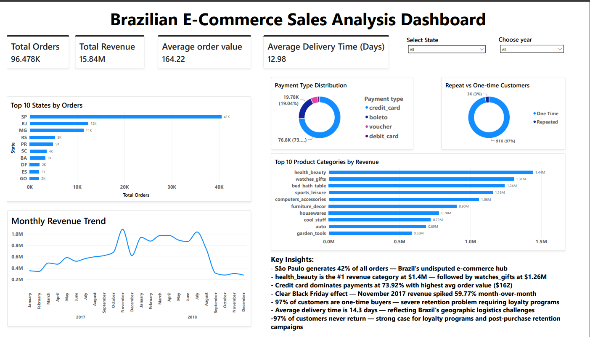

# Brazilian E-Commerce Sales Analysis

## Overview
End-to-end data analysis project analyzing 100,000+ real Brazilian e-commerce orders 
from Olist (2016-2018) using Python, PostgreSQL, and Power BI. Covers data cleaning, 
multi-table SQL analysis with JOINs and window functions, and an interactive business 
intelligence dashboard.

## Tools & Technologies
- **Python** — Data loading, cleaning, EDA, feature engineering
- **PostgreSQL** — Multi-table database setup, 10 analytical SQL queries
- **Power BI** — Interactive dashboard connected directly to PostgreSQL
- **Libraries** — Pandas, NumPy, Matplotlib

## Dataset
- **Source:** Brazilian E-Commerce Public Dataset by Olist (Kaggle)
- **Size:** 99,441 orders, 7 related tables
- **Period:** September 2016 — August 2018
- **Tables used:** orders, customers, order_items, payments, reviews, 
  products, sellers

## Project Structure
```
ecommerce-sales-analysis/
├── data/
│   ├── raw/                    # Original 9 CSV files from Kaggle
│   └── processed/              # 7 cleaned CSV files
├── notebooks/
│   ├── 01_data_understanding.ipynb
│   └── 02_data_cleaning.ipynb
├── sql/
│   └── ecommerce_analysis_queries.sql
├── dashboard/
│   ├── E-sales-analysis.pbix
│   └── dashboard_screenshot.png
├── README.md
└── .gitignore
```

## Part 1 — Python Data Cleaning

### Tables Cleaned
| Table | Original Rows | Cleaned Rows | Changes Made |
|-------|--------------|--------------|--------------|
| orders | 99,441 | 96,478 | Filtered to delivered orders only, converted 5 date columns to datetime |
| products | 32,951 | 32,951 | Joined with English category translation, filled 610 null categories with "uncategorized" |
| reviews | 99,224 | 99,224 | Dropped comment title and message columns (87K+ nulls), kept only review_score |
| payments | 103,886 | 103,883 | Removed 3 rows with "not_defined" payment type |
| customers | 99,441 | 99,441 | No changes needed |
| order_items | 112,650 | 112,650 | No changes needed |
| sellers | 3,095 | 3,095 | No changes needed |

### Key Cleaning Decisions
- Filtered to **delivered orders only** (96,478 of 99,441) — cancelled, shipped, 
  and processing orders excluded from revenue analysis
- Used `format='mixed'` for Brazilian date format (DD-MM-YYYY) conversion
- Identified and handled data quality issues — negative delivery times and 
  688-day outliers filtered using BETWEEN 0 AND 60 days in SQL
- Translated 73 Portuguese product category names to English using 
  provided translation table

## Part 2 — PostgreSQL Analysis

### Database Setup
- Created `ecommerce_db` database in PostgreSQL 18
- Loaded all 7 cleaned tables
- Wrote 10 business-focused SQL queries

### Table Row Counts (Verified)
```
sellers      →   3,095
products     →  32,951
orders       →  96,478
reviews      →  99,224
customers    →  99,441
payments     → 103,883
order_items  → 112,650
```

### SQL Skills Demonstrated
- INNER JOINs across 2, 3, and 4 tables
- GROUP BY with EXTRACT for date-based aggregations
- HAVING clause for filtering aggregated results
- CTEs (WITH clause) for multi-step logic
- CASE WHEN for customer segmentation
- LIMIT for Top N results
- BETWEEN for range filtering
- Window function — LAG() OVER (ORDER BY) for month-over-month growth
- UNION ALL for multi-table row count verification
- EPOCH for timestamp arithmetic (delivery days calculation)

### Key SQL Findings
| Business Question | Finding |
|---|---|
| Total revenue (delivered orders) | $15.84M across 96,478 orders |
| Avg order value | $164.22 |
| #1 revenue category | health_beauty — $1.41M |
| #2 revenue category | watches_gifts — $1.26M |
| #1 state by orders | SP (São Paulo) — 40,501 orders, $5.77M revenue |
| Most used payment method | Credit card — 73.92% of orders |
| Highest avg payment value | Credit card — $162.24 avg |
| Highest rated category (100+ orders) | books_general_interest — 4.51/5 |
| One-time customers | 90,557 (97%) |
| Repeat customers | 2,801 (3%) |
| Avg delivery time | 14.3 days |
| Peak revenue month | November 2017 — $1,082,628 (+59.77% MoM) |

## Part 3 — Power BI Dashboard

### Connection
Connected Power BI Desktop directly to PostgreSQL database 
(`localhost/ecommerce_db`) — not a static CSV import.

### DAX Measures Created
```
Total Revenue = SUM('public order_items'[price]) + SUM('public order_items'[freight_value])
Total Orders = DISTINCTCOUNT('public orders'[order_id])
Avg Order Value = DIVIDE([Total Revenue], [Total Orders])
Avg Delivery Days = AVERAGEX(FILTER(...), DATEDIFF(...))
One Time Customers = CALCULATE(DISTINCTCOUNT(...), FILTER(..., order_count = 1))
Repeat Customers = CALCULATE(DISTINCTCOUNT(...), FILTER(..., order_count > 1))
```

### Dashboard Visuals
- KPI cards — Total Orders, Total Revenue, Avg Order Value, Avg Delivery Days
- Monthly Revenue Trend (line chart — 2017 and 2018)
- Top 10 Product Categories by Revenue (bar chart)
- Top 10 States by Orders (bar chart)
- Payment Type Distribution (donut chart)
- Repeat vs One-time Customers (donut chart)
- Interactive slicers — State filter, Year filter (2017/2018)
- Key Insights text box

## Key Business Insights

- **São Paulo dominates** — generates 42% of all orders and $5.77M revenue 
  (37% of total) — Brazil's undisputed e-commerce hub for both buyers and sellers
- **health_beauty is the #1 category** — $1.41M revenue across 8,647 orders, 
  ahead of watches_gifts ($1.26M) which has a higher avg price ($199) but fewer orders
- **Credit card dominates payments** — 73.92% of all transactions with highest 
  avg order value ($162.24) — customers use cards for bigger purchases
- **Black Friday effect clearly visible** — November 2017 revenue spiked 59.77% 
  month-over-month to $1.08M, followed by a 42.80% drop in December — 
  confirming seasonal purchasing patterns
- **97% of customers never return** — only 2,801 of 93,358 unique customers 
  placed more than one order — severe retention problem that loyalty programs 
  could address
- **Average delivery time is 14.3 days** — reflecting Brazil's geographic 
  logistics challenges across a continent-sized country
- **Data quality finding** — identified negative delivery times and 688-day 
  outliers in raw data — filtered using BETWEEN 0 AND 60 days for accurate analysis

## Business Recommendations

1. **Invest heavily in SP market** — nearly half of all revenue comes from one state; 
   doubling down on São Paulo logistics and marketing has the highest ROI
2. **Launch customer loyalty program immediately** — 97% one-time buyer rate means 
   customer acquisition cost is wasted; even moving to 10% repeat rate would 
   significantly impact revenue
3. **Prioritize health_beauty and watches_gifts categories** — highest revenue 
   categories with strong avg order values; targeted promotions here 
   yield maximum return
4. **Leverage Black Friday aggressively** — the data shows 60% revenue spike is 
   achievable; plan inventory and marketing campaigns 2-3 months in advance
5. **Investigate delivery time reduction** — 14.3 day average is high; 
   partnering with regional logistics providers in top states could improve 
   customer satisfaction scores

## Dashboard Preview
